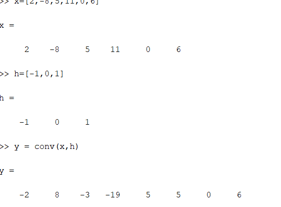
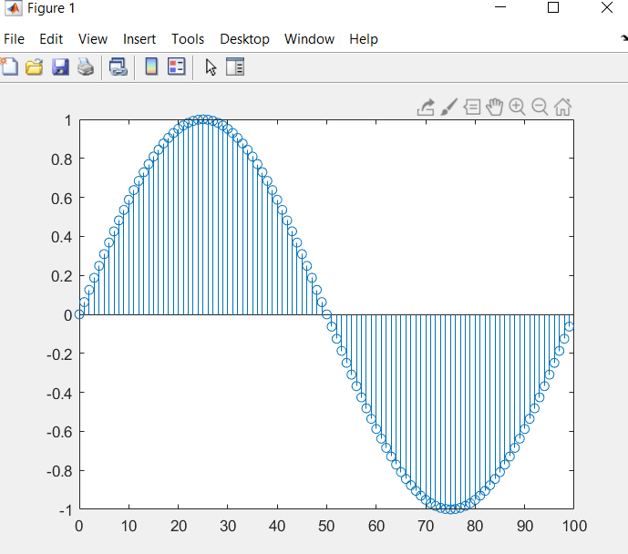
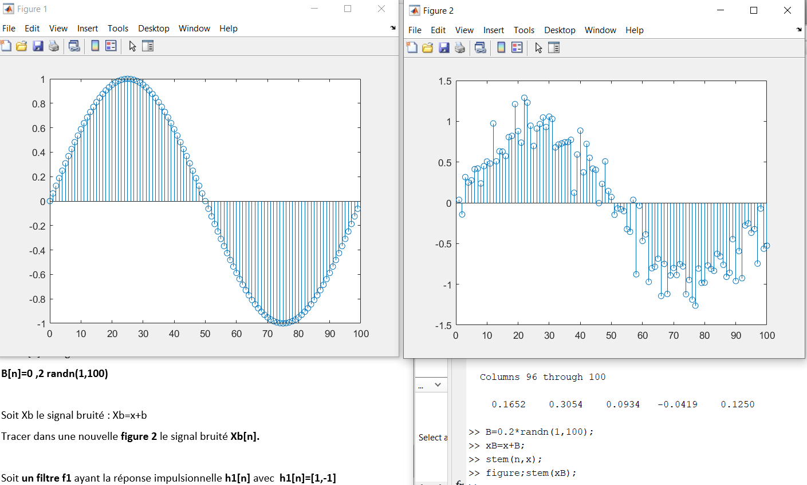
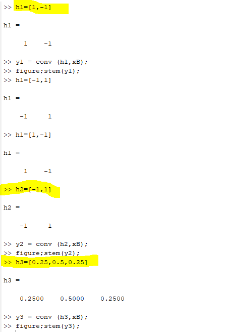
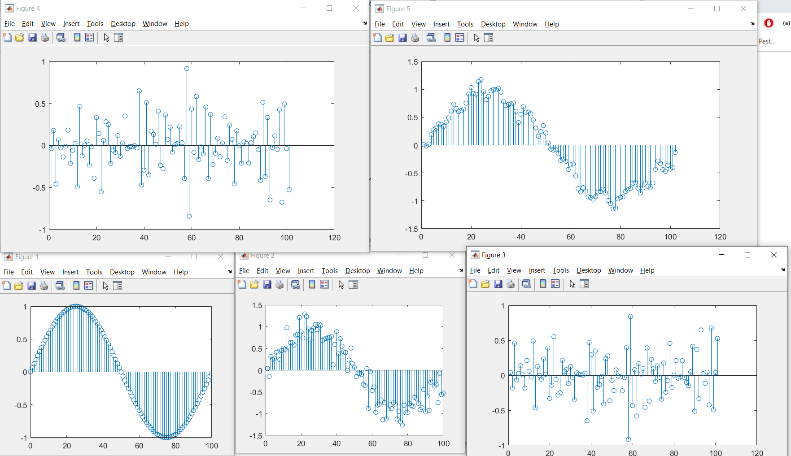
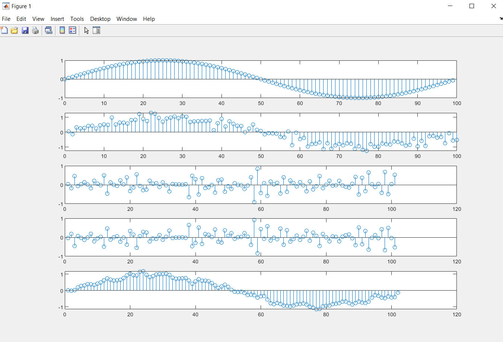

# Traitement De Signal
## TP2: (Realiser par `Ben Rejeb Mohamed Hedi` et `Cherchari Wahb` )
### 1/ Déterminer y[n] le produit de convolution de  x[n] et h[n] : y[n]=x[n]*h[n]   
### Sachant que x[n]=[ 2, -8, 5, 11, 0, 6] et h[n]=[-1, 0, 1] 
```console
>> x=[2,-8,5,11,0,6]
>> h=[-1,0,1]
>> y = conv(x,h) 
```

### 2/ Soit un signal discret x[n]= sin(2(pi/100)n) :   
###   a/ Tracer x[n] en fonction de n pour n=[0 : 99]  :
```console
>> n=[0:99];
>> x= sin(2*(pi/100)*n);
>> stem(n,x); 
```

###   a/ Soit b[n] un signal bruit aléatoire :   
```console
>> B=0.2*randn(1,100);
```
###   b/ Soit Xb le signal bruité : xB=x+B
###   Tracer xB[n]:
```console
>> xB=x+B;
>> figure;stem(xB);
```

###   c/ Soit un filtre f1 ayant la réponse impulsionnelle h1[n] avec  h1[n]=[1,-1]:   
```console
>> h1=[1,-1]
>> y1 = conv (h1,xB);
>> figure;stem(y1);
```
###   d/ Soit un filtre f2 ayant la réponse impulsionnelle h2[n] avec h2[n]=[-1,1] :
```console
>> h2=[-1,1]
>> y2 = conv (h2,xB);
>> figure;stem(y2);
```
###   e/ Soit un filtre f3 ayant la réponse impulsionnelle h3[n] avec h3[n]=[0.25,   0.5 , 0.25]  :
```console
>> h3=[0.25,0.5,0.25]
>> y3 = conv (h3,xB);
>> figure;stem(y3);
```
### Commandes : 


### Figures :


###   g/Tracer dans une même figure  les courbes: 
```console
>> subplot(5,1,1)
>> stem(n,x)
>> subplot(5,1,2)
>> stem(xB)
>> subplot(5,1,3)
>> stem(y1)
>> subplot(5,1,4)
>> stem(y2)
>> subplot(5,1,5)
>> stem(y3)
```

